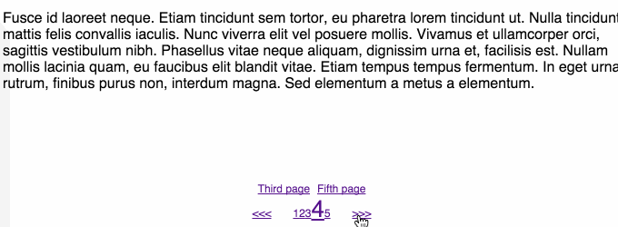

# react-shift
A simple, paginated carousel component for [JSX](https://facebook.github.io/react/docs/jsx-in-depth.html) elements. `react-shift` can be used to serve pages of content or dropped as a small component into a larger stack.

## Installation
```
npm install react-shift --save
```

## Getting started
```jsx
render(
  <Shift>
    <div>First page</div>
    <div>Second page</div>
    <div>Third page</div>
  </Shift>,
  node
);
```

## Demo

`npm run demo`

Open `demo.html` in a browser.

## Customization
The component can be passed objects as props to customize the navigation.

* ```arrowLabels``` specifies custom next and previous page link labels.

* ```fastLinks``` creates a shortcut link to a page, where the key is the link name and the value is the page index.

* ```scrollable``` specifies if mouse wheel scrolling triggers page change. The scroll event trigger is attached to ```#react-shift-wrapper```. Defaults to ```true```. **Experimental**

* ```transitions``` specifies if [ReactCSSTransitionGroup](https://facebook.github.io/react/docs/animation.html) is applied to page transitions. Defaults to ```false```.

Example:
```jsx
const arrowLabels = {
  next: ">>>",
  previous: "<<<"
};

const fastLinks = {
  "Third page": 2,
  "Fifth page": 4
};

React.render(
  <Shift
    arrowLabels={arrowLabels}
    fastLinks={fastLinks}
    scrollable={false}>
    <div>First page</div>
    <div>Second page</div>
    <div>Third page</div>
  </Shift>,
  document.getElementById("react-shift-anchor")
);
```

## Styling
```css
/* component wrapper */
#react-shift-wrapper {
}

/* page division */
#react-shift-page {
}

/* navigation */
#react-shift-navigation {
}

/* navigation arrows */
.react-shift-nav-arrow {
  display: inline-block; /* Recommended */
  width: 80px; /* Set to maintain spacing on arrow exit */
}
#react-shift-next-page {
}
#react-shift-previous-page {
}

/* pagination */
#react-shift-pagination {
}
.react-shift-current-page {
}

/* fast links */
#react-shift-fast-links {
}
.react-shift-fast-link {
}
```

## Transition animations example
```css
/* minimum required for clean page transition */
.react-shift-page-enter {
  position: absolute;
  right: 0; left: 0;
  opacity: 0.01;
  transition: opacity .25s ease-in;
}
.react-shift-page-enter.react-shift-page-enter-active {
  opacity: 1;
}
.react-shift-page-leave {
  position: absolute;
  right: 0; left: 0;
  opacity: 1;
  transition: opacity .25s ease-in;
}
.react-shift-page-leave.react-shift-page-leave-active {
  position: absolute;
  opacity: 0.01;
  transition: opacity .25s ease-in;
}
```
